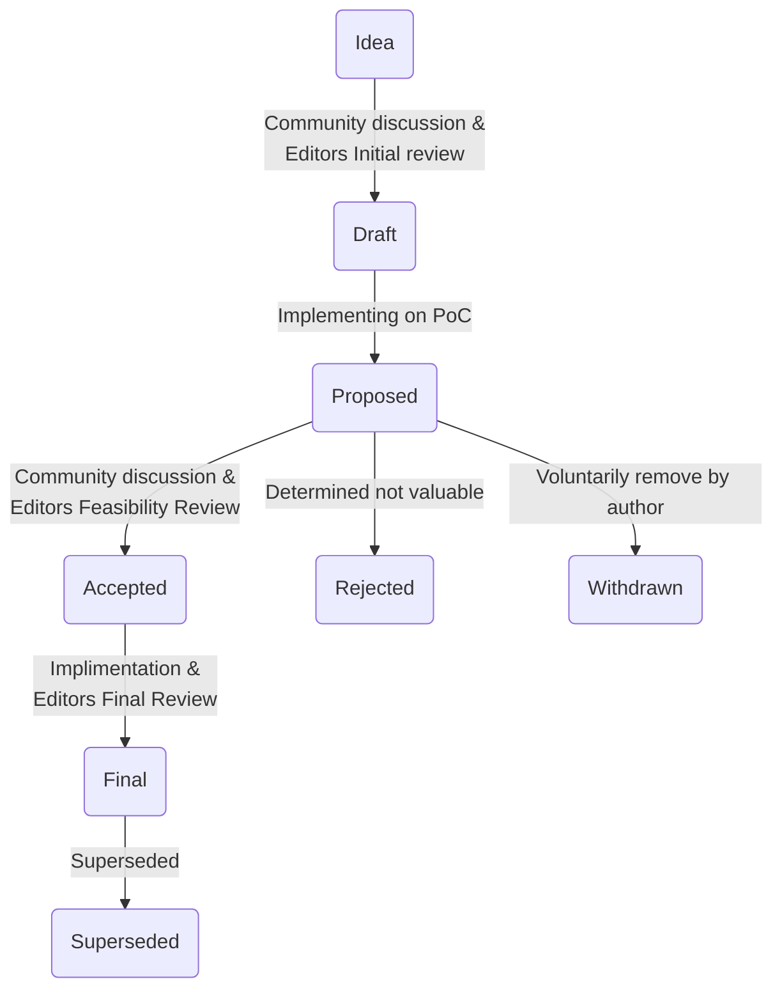

VeChain Improvement Proposals
====

VIP stands for VeChain Improvement Proposal. It is a design document providing information, or describing a new feature. It describe standards for the VeChain ecosystem, including core protocol specifications, client APIs, and contract standards. The VIP should provide a concise technical specification of the feature.

The VIP author is responsible for building consensus within the community and documenting dissenting opinions.

## Proposals

| No.                      | Title                          | Owner   | Category    | Status |
| ------------------------ | ------------------------------ | ------- | ----------- | ------ |
| [180](./vips/VIP-180.md) | Fungible Token Standard        | VeChain | Application | Final  |
| [181](./vips/VIP-181.md) | Non-Fungible Token Standard    | VeChain | Application | Accepted  |
| [190](./vips/VIP-190.md) | Personal Sign Standard         | Totient Labs | Interface | Final  |
| [191](./vips/VIP-191.md) | Designated Gas Payer           | Totient Labs | Core | Draft  |
| [192](./vips/VIP-192.md) | Simple Self-signed Certificate | Qian Bin | Interface | Draft |
| [193](./vips/VIP-193.md) | Committee-Based POA | Ziheng Zhou (peter.zhou@vechain.com) and Zhijie Ren (zhijie.ren@vechain.com) | Core | Draft |
| [200](./vips/VIP-200.md) | Implementation of SURFACE BFT Protocol | Ziheng Zhou (peter.zhou@vechain.com) and Zhijie Ren (zhijie.ren@vechain.com) | Core | Draft |
| [201](./vips/VIP-201.md) | Simple Gas Payer Standard | Xiqing Chu <xiqing.chu@vechain.com> & Mog Lu <mog.lu@vechain.com> | Information | Draft |
| [210](./vips/VIP-210.md) | Semi-Fungible Token(SFT) Standard | VeChain | Application | Draft |
| [214](./vips/VIP-214.md) | Per Epoch VRF-Based Random Beacon Generation | Zhijie Ren (zhijie.ren@vechain.com) and Ziheng Zhou (peter.zhou@vechain.com) | core | Draft |
| [220](./vips/VIP-220.md) | Finality with One Bit (FOB) | Zhijie Ren (zhijie.ren@vechain.com) and Ziheng Zhou (peter.zhou@vechain.com) | core | Draft |
| [230](./vips/VIP-230.md) | The Ultimate State Pruner | TestUser (@testuser) | core | Draft |

## Categories:

+ **Core**: These VIPs describe improvements that require a consensus fork.
+ **Application**: These VIPs describe application-level standards and conventions, including contract standards.
+ **Interface**: These VIPs describe improvements around client API specifications and standards, and also certain language-level standards like method names and contract ABIs.
+ **Information**: These VIPs describe a design issue or provide general guidelines or information to the community, but do not propose a new feature.

## Status Terms
VIPs can have the following statuses:

The different stages are:
+ **Draft**: A VIP in draft status must conduct a PoC (Proof of Concept) to verify the feasibility to be considered for promotion to the next status. A VIP in Draft is a preliminary version that is not yet ready for consideration by the VeChain community. A VIP in this state is a work in progress and may be updated, replaced, or rejected based on feedback from the community.
+ **Proposed**: A VIP that is done with its initial iteration and ready for review by a wide audience. A VIP in Proposed has been submitted to the VeChain community for review and discussion. It is the responsibility of the community to review and provide feedback on the proposed VIP.
+ **Accepted**: A VIP in Accepted has been reviewed and discussed by the VeChain community and has reached a consensus that the proposal is valuable and should be implemented. A VIP in this state is ready for implementation. 
+ **Final**: This VIP represents the current state-of-the-art. A Final VIP should only be updated to correct errata. A VIP in Final has been implemented in the VeChain ecosystem. A VIP in this state is considered complete and closed.
+ **Rejected**: A VIP in Rejected has been reviewed by the VeChain community and determined to be not valuable or feasible to implement in the VeChain ecosystem.
+ **Superseded**: A VIP in Superseded has been replaced by a newer VIP.
+ **Withdrawn**: A VIP in Withdrawn has been voluntarily removed from consideration by the author or the VeChain community.

## VIP Guidelines

To create a new VIP, please follow these guidelines:
+ Use [the VIP template](vip-template.md) as a starting point.
+ Fill in all the required fields in the template.
+ Choose the appropriate VIP category (Core, Application, Interface, or Information).
+ Submit a pull request with your VIP to the VeChain VIPs repository.
+ Once submitted, your VIP will go through the VIP lifecycle and be reviewed and discussed by the VeChain community.

### Submitting a VIP

Anyone can submit a VIP to propose changes or improvements to the VeChain protocol. To
submit a VIP, follow these steps:
1. Create a new topic on the VeChain Discourse for community discussion and feedback regarding your VIP proposal. Provide a clear and detailed description of your proposal to facilitate meaningful discussions.
2. Fork the VeChain VIP repository on GitHub.
3. Create a new branch for your proposed VIP.
4. Copy [the VIP template](vip-template.md) into your new branch and fill in the details of your proposal.
5. Submit a pull request with your VIP branch against the master branch of the VeChain VIP repository.
6. Your proposal will be reviewed by the VeChain community and the VIP editors, who will provide feedback and suggest changes to improve the proposal.

### VIP Review Process

When a VIP is submitted, it goes through a review process before it is accepted or rejected. The review process includes the following steps:
+ **Initial Review**: The VIP editors will perform an initial review of the proposal to ensure that it meets the submission guidelines and is a reasonable proposal for the VeChain platform. A working group of editors approved will be formed to discuss the details of the VIP and review.
+ **Discussion**: The VIP will be open for discussion by the VeChain community, who can provide feedback and suggest changes to the proposal.
+ **Feasibility Review**: The editors in the working group will review the technical details and feasibility of the VIP until all the editors are in agreement and have no issues with the VIP.
+ **Final Review**: The VIP editors will perform a final review of the proposal for the implementation.This review will consider the community feedback. The editors will make a decision to accept or reject the proposal.

### VIP Implementation
VIPs that are accepted will be implemented in a future release of the VeChain protocol. The implementation process may involve the following steps:
+ **Specification**: The technical specification of the VIP will be updated to include implementation details.
+ **Testing**: The VIP will be tested by the VeChain development team to ensure that it functions as intended and does not introduce any security vulnerabilities.
+ **Release**: The VIP will be released in a future version of the VeChain protocol.

## Conclusion

VeChain Improvement Proposals (VIPs) are a way for the community to propose and discuss improvements to the VeChain ecosystem. By following the VIP guidelines, anyone can contribute to the development of the VeChain blockchain.
